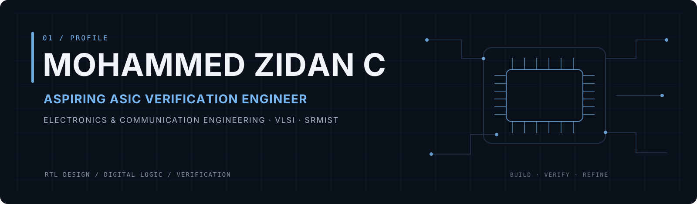

  

  

  <table border="1" bordercolor="#26384E" cellpadding="8" cellspacing="6">
    <tr>
      <td bgcolor="#101A2A"><a href="#mz-about"><strong>ABOUT</strong></a></td>
      <td bgcolor="#101A2A"><a href="#mz-focus"><strong>CURRENT FOCUS</strong></a></td>
      <td bgcolor="#101A2A"><a href="#mz-projects"><strong>PROJECTS</strong></a></td>
      <td bgcolor="#101A2A"><a href="#mz-skills"><strong>SKILLS</strong></a></td>
      <td bgcolor="#101A2A"><a href="#mz-credentials"><strong>CREDENTIALS</strong></a></td>
      <td bgcolor="#101A2A"><a href="#mz-contact"><strong>CONTACT</strong></a></td>
    </tr>
  </table>

01 / About

I am an Electronics and Communication Engineering student at SRMIST with a focused interest in VLSI, RTL design, and ASIC verification. I am building hands-on depth in Verilog and digital logic, while using Python, AI tools, and software workflows as supporting tools for experimentation and engineering work.

<strong>Design. Verify. Refine.</strong>

02 / Current Focus

<table width="100%" border="1" bordercolor="#26384E" cellpadding="0" cellspacing="0">
  <tr>
    <td bgcolor="#111C2D" width="18%" align="center" valign="middle">
      <strong>LATEST</strong> 
      REPOSITORY
    </td>
    <td bgcolor="#101826" valign="top">
      <!-- LATEST_REPO:START -->
      <table width="100%" border="0" cellpadding="14" cellspacing="0">
        <tr>
          <td>
            LATEST REPOSITORY 
            <h3>Loading latest repository…</h3>
            This panel is maintained automatically by GitHub Actions.
          </td>
        </tr>
      </table>
      <!-- LATEST_REPO:END -->
    </td>
  </tr>
</table>

03 / Featured Engineering Work

<table width="100%" border="1" bordercolor="#26384E" cellpadding="0" cellspacing="8">
  <tr>
    <td bgcolor="#101A2A" width="50%" valign="top">
      01 / RTL &amp; DIGITAL DESIGN
      <h3>Architecture-first work</h3>
      
Dedicated space for Verilog designs, block diagrams, simulation evidence, and implementation notes.

      VERILOG · RTL · DIGITAL LOGIC
    </td>
    <td bgcolor="#101A2A" width="50%" valign="top">
      02 / VERIFICATION
      <h3>Proof through simulation</h3>
      
Dedicated space for testbenches, waveforms, verification results, debugging evidence, and repository links.

      TESTBENCH · SIMULATION · DEBUGGING
    </td>
  </tr>
  <tr>
    <td bgcolor="#101A2A" valign="top">
      03 / SYSTEMS
      <h3>Hardware beyond RTL</h3>
      
Space for STM32 and other embedded engineering work that supports the broader hardware portfolio.

      STM32 · EMBEDDED · INTERFACING
    </td>
    <td bgcolor="#101A2A" valign="top">
      04 / EVIDENCE
      <h3>Design artifacts</h3>
      
Projects can be presented with architecture diagrams, waveforms, test results, and source links without changing this layout.

      DIAGRAMS · WAVEFORMS · SOURCE
    </td>
  </tr>
</table>

04 / Technical Toolkit

Hardware & Digital Design

<table border="1" bordercolor="#26384E" cellpadding="9" cellspacing="6">
  <tr>
    <td bgcolor="#101A2A"><a href="certificates/235197-Verilog%20HDL%20Hands%20On%20Mohammed%20Zidan%20C.pdf"><strong>◇ VERILOG</strong></a> CERTIFICATE</td>
    <td bgcolor="#101A2A"><a href="certificates/Udemy%20Digital%20Logic%20Design.pdf"><strong>⊞ DIGITAL LOGIC</strong></a> CERTIFICATE</td>
    <td bgcolor="#101A2A"><strong>⌁ RTL DESIGN</strong> CORE FOCUS</td>
    <td bgcolor="#101A2A"><strong>◫ SIMULATION</strong> CORE FOCUS</td>
  </tr>
</table>

Programming & Engineering Tools

<table border="1" bordercolor="#26384E" cellpadding="9" cellspacing="6">
  <tr>
    <td bgcolor="#101A2A"><a href="certificates/udemy%20python.jpg"><strong>λ PYTHON</strong></a> CERTIFICATE</td>
    <td bgcolor="#101A2A"><a href="certificates/cpp%20saylor.pdf"><strong>⊕ C++</strong></a> CERTIFICATE</td>
    <td bgcolor="#101A2A"><strong>⎇ GIT</strong> ENGINEERING TOOL</td>
  </tr>
</table>

AI & Supporting Tools

<table border="1" bordercolor="#26384E" cellpadding="9" cellspacing="6">
  <tr>
    <td bgcolor="#101A2A"><a href="certificates/Freedom%20with%20AI%20-%20Certificate.pdf"><strong>✦ ARTIFICIAL INTELLIGENCE</strong></a> CERTIFICATE</td>
    <td bgcolor="#101A2A"><strong>◒ HUGGING FACE</strong> SUPPORTING TOOL</td>
  </tr>
</table>

05 / Credentials

Google Skills Badges

<table border="1" bordercolor="#26384E" cellpadding="10" cellspacing="8">
  <tr>
    <td bgcolor="#101A2A" align="center">
      
       
      VERIFIED ON GOOGLE SKILLS
    </td>
    <td bgcolor="#101A2A" align="center">
      
       
      VERIFIED ON GOOGLE SKILLS
    </td>
  </tr>
</table>

01 / Engineering & Technical

<table width="100%" border="1" bordercolor="#2A3C52" cellpadding="11" cellspacing="6">
  <tr>
    <td bgcolor="#142135" width="50%"><a href="certificates/235197-Verilog%20HDL%20Hands%20On%20Mohammed%20Zidan%20C.pdf"><strong>Verilog HDL — Hands On</strong></a> MAVEN SILICON · VIEW CREDENTIAL ↗</td>
    <td bgcolor="#142135" width="50%"><a href="certificates/Udemy%20Digital%20Logic%20Design.pdf"><strong>Digital Logic Design: A Complete Guide</strong></a> UDEMY · VIEW CREDENTIAL ↗</td>
  </tr>
  <tr>
    <td bgcolor="#142135"><a href="certificates/Udemy%20Signal%20Processing.pdf"><strong>Signal Processing</strong></a> UDEMY · VIEW CREDENTIAL ↗</td>
    <td bgcolor="#142135"><a href="certificates/cpp%20saylor.pdf"><strong>CS107: C++ Programming</strong></a> SAYLOR ACADEMY · VIEW CREDENTIAL ↗</td>
  </tr>
  <tr>
    <td bgcolor="#142135"><a href="certificates/udemy%20python.jpg"><strong>Python for Beginners: The Complete Course</strong></a> UDEMY · VIEW CREDENTIAL ↗</td>
    <td bgcolor="#142135"><a href="certificates/Freedom%20with%20AI%20-%20Certificate.pdf"><strong>Freedom with AI Masterclass</strong></a> FREEDOM WITH AI · VIEW CREDENTIAL ↗</td>
  </tr>
  <tr>
    <td bgcolor="#142135"><a href="certificates/Anthropic%20Claude%20Code%20101.pdf"><strong>Anthropic Claude Code 101</strong></a> VIEW CREDENTIAL ↗</td>
    <td bgcolor="#142135"><a href="certificates/POD%20AI%20Developer%20Tools%20and%20Methodologies.pdf"><strong>POD AI Developer Tools and Methodologies</strong></a> VIEW CREDENTIAL ↗</td>
  </tr>
</table>

02 / Professional Development

<table width="100%" border="1" bordercolor="#2A3C52" cellpadding="11" cellspacing="6">
  <tr>
    <td bgcolor="#142135" width="50%"><a href="certificates/Employability%20skills.pdf"><strong>Employability Skills</strong></a> VIEW CREDENTIAL ↗</td>
    <td bgcolor="#142135" width="50%"><a href="certificates/Udemy%20Employability%20skills%20Mastery.pdf"><strong>Employability Skills Mastery</strong></a> UDEMY · VIEW CREDENTIAL ↗</td>
  </tr>
  <tr>
    <td bgcolor="#142135"><a href="certificates/Job%20Readiness%20%26%20Professional%20Development%20Program.pdf"><strong>Job Readiness &amp; Professional Development Program</strong></a> VIEW CREDENTIAL ↗</td>
    <td bgcolor="#142135"><a href="certificates/british%20airways%20forage.pdf"><strong>British Airways Forage Job Simulation</strong></a> VIEW CREDENTIAL ↗</td>
  </tr>
</table>

03 / Memberships & Workshops

<table width="100%" border="1" bordercolor="#2A3C52" cellpadding="11" cellspacing="6">
  <tr>
    <td bgcolor="#142135" width="50%"><a href="certificates/ISTE%20Membership.pdf"><strong>ISTE Membership</strong></a> VIEW CREDENTIAL ↗</td>
    <td bgcolor="#142135" width="50%"><a href="certificates/Embedded%20system%20Team%20ARL.jpg"><strong>Embedded Systems Workshop</strong></a> TEAM ARL / SRMIST · VIEW CREDENTIAL ↗</td>
  </tr>
</table>

04 / Achievements & Activities

<table width="100%" border="1" bordercolor="#2A3C52" cellpadding="11" cellspacing="6">
  <tr>
    <td bgcolor="#142135" width="50%"><a href="certificates/Reuse%20and%20Remodel%20Product.jpg"><strong>1st Prize — Reuse and Remodel Product Competition</strong></a> SRMIST · VIEW EVIDENCE ↗</td>
    <td bgcolor="#142135" width="50%"><a href="certificates/WMO%20Volunteering.jpeg"><strong>WMO Volunteering</strong></a> VIEW EVIDENCE ↗</td>
  </tr>
  <tr>
    <td bgcolor="#142135"><a href="certificates/Sustainable%20development.pdf"><strong>Sustainable Development</strong></a> VIEW CREDENTIAL ↗</td>
    <td bgcolor="#142135">&nbsp;</td>
  </tr>
</table>

06 / Contact

<table border="1" bordercolor="#26384E" cellpadding="10" cellspacing="6">
  <tr>
    <td bgcolor="#101A2A">
      <a href="https://www.linkedin.com/in/mohammed-zidan-c/">
        &nbsp; <strong>LinkedIn</strong>
      </a>
    </td>
    <td bgcolor="#101A2A">
      <a href="https://wa.me/918590919142">
        &nbsp; <strong>WhatsApp</strong>
      </a>
    </td>
    <td bgcolor="#101A2A">
      <a href="https://www.instagram.com/notmohammedzidan/">
        &nbsp; <strong>Instagram</strong>
      </a>
    </td>
    <td bgcolor="#101A2A">
      <a href="https://www.threads.net/@notmohammedzidan">
        &nbsp; <strong>Threads</strong>
      </a>
    </td>
    <td bgcolor="#101A2A">
      <a href="https://www.facebook.com/people/%D9%85%D8%AD%D9%85%D8%AF-%D8%B2%D9%8A%D8%AF%D8%A7%D9%86/pfbid02v64aWcXWmXY3TncgtJKsFGEmUnr1Y2n1FieF78Eczix446Y6TXDN6ak97XS6t9o3l/">
        &nbsp; <strong>Facebook</strong>
      </a>
    </td>
  </tr>
</table>

  VLSI · RTL DESIGN · VERIFICATION · CONTINUOUS LEARNING

