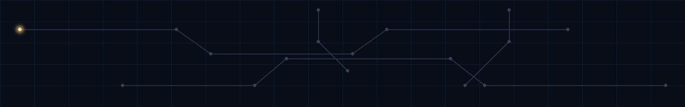

  

  <h1>Mohammed Zidan C</h1>

  

    <strong>ASPIRING ASIC VERIFICATION ENGINEER</strong> 
    Electronics & Communication Engineering · VLSI · SRMIST
  

  

    <a href="#about">About</a> ·
    <a href="#current-focus">Current Focus</a> ·
    <a href="#featured-engineering-work">Projects</a> ·
    <a href="#technical-toolkit">Skills</a> ·
    <a href="#credentials">Credentials</a> ·
    <a href="#contact">Contact</a>
  

About

I am an Electronics and Communication Engineering student at SRMIST with a focused interest in VLSI, RTL design, and ASIC verification. I am building a strong foundation in Verilog and digital logic, while using Python, AI tools, and software workflows as supporting skills for experimentation and engineering work.

Design. Verify. Learn.

Current Focus

<!-- LATEST_REPO:START -->
<table>
  <tr>
    <td align="left" width="760">
      <strong>LATEST ENGINEERING WORK</strong>  
      <a href="https://github.com/MohammedZidanC/Health_Advisor"><strong>Health_Advisor</strong></a>  
      No repository description provided.  
      <code>HTML</code> &nbsp; <code>Created 13 Apr 2026</code>
        
      <a href="https://github.com/MohammedZidanC/Health_Advisor">VIEW REPOSITORY →</a>
    </td>
  </tr>
</table>
<!-- LATEST_REPO:END -->

Featured Engineering Work

This section is intentionally kept ready for the projects you are going to add. Each project can later include its own architecture diagram, waveform, testbench evidence, implementation notes, and source link without changing the overall profile design.

<!-- PROJECT CARD TEMPLATE

<table>
  <tr>
    <td width="50%" valign="top">
      <h3>Project Name</h3>
      Verilog · RTL Design · Simulation
        
      One concise sentence describing what was designed and verified.
        
      <a href="PROJECT_REPOSITORY_URL">View Repository →</a>
    </td>
    <td width="50%" valign="top" align="center">
      
    </td>
  </tr>
</table>

-->

Technical Toolkit

Hardware & Digital Design

  
  
  
  

Programming & Engineering Tools

  
  
  

AI & Supporting Tools

  
  

Credentials

Google Skills Badges

  
  

Click either badge to open the corresponding first-party Google Skills credential page.

<strong>Engineering & Technical Credentials</strong>

 

<a href="certificates/235197-Verilog%20HDL%20Hands%20On%20Mohammed%20Zidan%20C.pdf">Verilog HDL — Hands On</a> — Maven Silicon

<a href="certificates/Udemy%20Digital%20Logic%20Design.pdf">Digital Logic Design: A Complete Guide</a> — Udemy

<a href="certificates/Udemy%20Signal%20Processing.pdf">Signal Processing</a> — Udemy

<a href="certificates/cpp%20saylor.pdf">CS107: C++ Programming</a> — Saylor Academy

<a href="certificates/udemy%20python.jpg">Python for Beginners: The Complete Course</a> — Udemy

<a href="certificates/Freedom%20with%20AI%20-%20Certificate.pdf">Freedom with AI Masterclass</a> — Freedom with AI

<a href="certificates/Anthropic%20Claude%20Code%20101.pdf">Anthropic Claude Code 101</a>

<a href="certificates/POD%20AI%20Developer%20Tools%20and%20Methodologies.pdf">POD AI Developer Tools and Methodologies</a>

<strong>Professional Development</strong>

 

<a href="certificates/Employability%20skills.pdf">Employability Skills</a>

<a href="certificates/Udemy%20Employability%20skills%20Mastery.pdf">Employability Skills Mastery</a> — Udemy

<a href="certificates/Job%20Readiness%20%26%20Professional%20Development%20Program.pdf">Job Readiness & Professional Development Program</a>

<a href="certificates/british%20airways%20forage.pdf">British Airways Forage Job Simulation</a>

<strong>Memberships & Workshops</strong>

 

<a href="certificates/ISTE%20Membership.pdf">ISTE Membership</a>

<a href="certificates/Embedded%20system%20Team%20ARL.jpg">Embedded Systems Workshop</a> — Team ARL / SRMIST

<strong>Achievements & Activities</strong>

 

<a href="certificates/Reuse%20and%20Remodel%20Product.jpg">1st Prize — Reuse and Remodel Product Competition</a> — SRMIST

<a href="certificates/WMO%20Volunteering.jpeg">WMO Volunteering</a>

<a href="certificates/Sustainable%20development.pdf">Sustainable Development</a>

Engineering Notes

A place for future design notes, verification experiments, waveforms, debugging write-ups, and implementation decisions. As these become available, they can be linked here without changing the rest of the profile structure.

<!-- NOTES TEMPLATE

<strong>Note title</strong>

Short context, key observation, result, and repository or document link.

-->

Activity

  

Activity cards are informational only; the source of truth is the GitHub profile and repository history.

Contact

  
  
  
  
  

  Built around hardware curiosity, verification discipline, and continuous learning.

