

  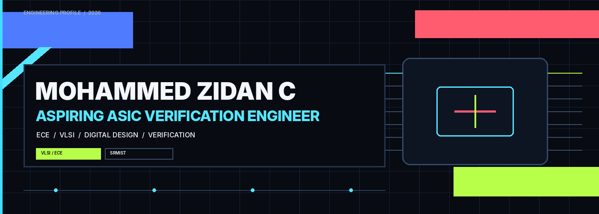

   
  <a href="#about">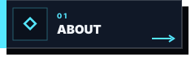</a>
  <a href="#current-focus">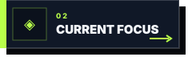</a>
  <a href="#featured-work">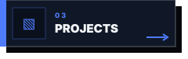</a>
   
  <a href="#technical-toolkit">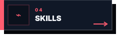</a>
  <a href="#credentials">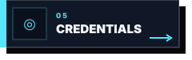</a>
  

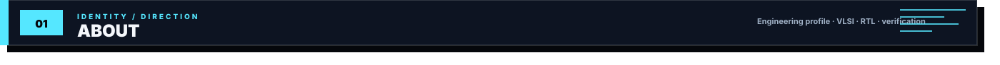

<table width="100%" border="0" cellpadding="0" cellspacing="0">
  <tr>
    <td width="68%" valign="top">
      <h3>Building toward silicon.</h3>
      

        I am an Electronics and Communication Engineering student at SRMIST with a focused interest in
        <strong>VLSI, RTL design, digital logic, and ASIC verification</strong>. I am building hands-on depth in
        <strong>Verilog, simulation, and hardware-oriented problem solving</strong>, while using Python, AI tools,
        and software projects as supporting layers for experimentation and engineering work.
      

      
<strong>Design.</strong> <strong>Verify.</strong> <strong>Refine.</strong>

    </td>
    <td width="4%"></td>
    <td width="28%" valign="top">
      <table width="100%" border="1" bordercolor="#2B3B54" cellpadding="10" cellspacing="0">
        <tr><td bgcolor="#101827">PRIMARY DIRECTION <strong>VLSI / ASIC VERIFICATION</strong></td></tr>
        <tr><td bgcolor="#0E1725">CORE LANGUAGE <strong>VERILOG</strong></td></tr>
        <tr><td bgcolor="#101827">ACADEMIC HOME <strong>SRMIST · ECE</strong></td></tr>
      </table>
    </td>
  </tr>
</table>

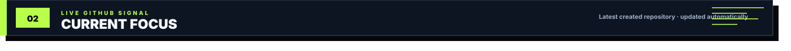

<table width="100%" border="0" cellpadding="0" cellspacing="0">
  <tr>
    <td bgcolor="#111B2B">
      <table width="100%" border="1" bordercolor="#304663" cellpadding="0" cellspacing="0">
        <tr>
          <td bgcolor="#16243A" width="20%" valign="top" align="center">
              
            <strong>LIVE GITHUB SIGNAL</strong>
              
            AUTOMATIC
          </td>
          <td bgcolor="#101827" valign="top">
            <!-- LATEST_REPO:START -->
<table width="100%" border="0" cellpadding="0" cellspacing="0">
  <tr>
    <td>
      LATEST REPOSITORY 
      <h3><a href="https://github.com/MohammedZidanC/Health_Advisor">Health_Advisor</a></h3>
      
No repository description has been added yet.

      <code>HTML</code> &nbsp; <code>Created 13 Apr 2026</code>
        
      <a href="https://github.com/MohammedZidanC/Health_Advisor"><strong>VIEW REPOSITORY ↗</strong></a>
    </td>
  </tr>
</table>
<!-- LATEST_REPO:END -->
          </td>
        </tr>
      </table>
    </td>
  </tr>
</table>

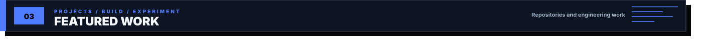

  <a href="https://github.com/MohammedZidanC/Luma">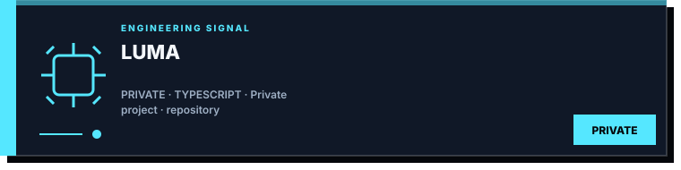</a>
  <a href="https://github.com/MohammedZidanC/Portfolio">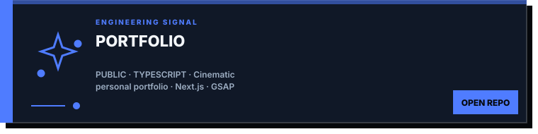</a>
   
  <a href="https://github.com/MohammedZidanC/Health_Advisor">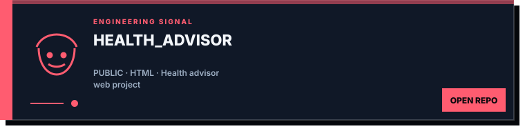</a>
  <a href="https://github.com/MohammedZidanC/FileSnap">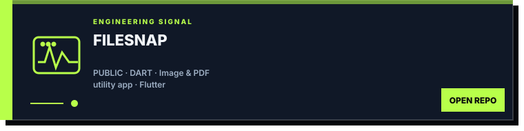</a>
   
  <a href="https://github.com/MohammedZidanC/VANTAGE">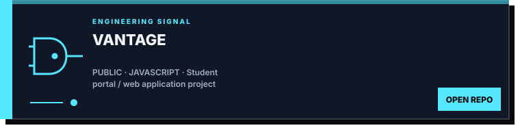</a>
  <a href="https://github.com/MohammedZidanC/NYX">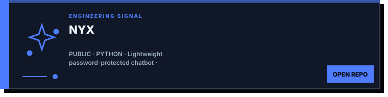</a>
   
  <a href="https://github.com/MohammedZidanC/To-Do-List">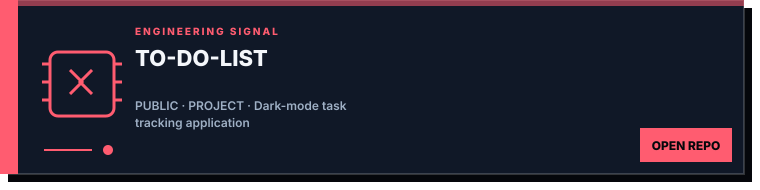</a>
  <a href="https://github.com/MohammedZidanC?tab=repositories">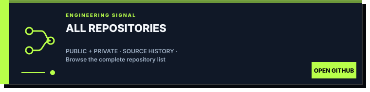</a>

Each card is the interface; clicking anywhere on it opens the destination.

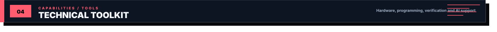

<strong>HARDWARE / DIGITAL / VERIFICATION</strong>

  <a href="certificates/235197-Verilog%20HDL%20Hands%20On%20Mohammed%20Zidan%20C.pdf">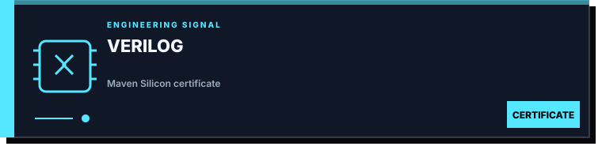</a>
  <a href="certificates/Udemy%20Digital%20Logic%20Design.pdf">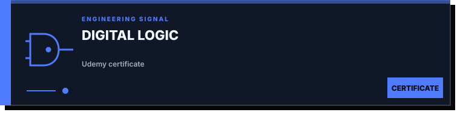</a>
  <a href="https://github.com/MohammedZidanC?tab=repositories&q=Verilog">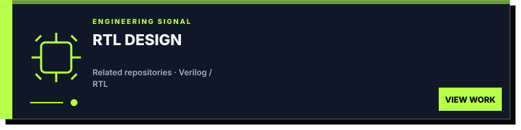</a>
  <a href="https://github.com/MohammedZidanC?tab=repositories&q=simulation">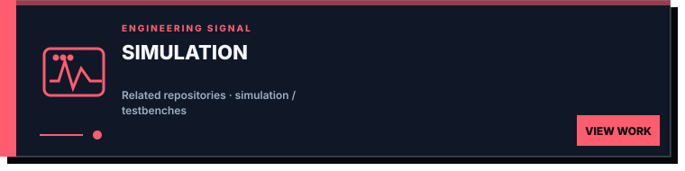</a>

<strong>PROGRAMMING / ENGINEERING TOOLS</strong>

  
  <a href="certificates/cpp%20saylor.pdf">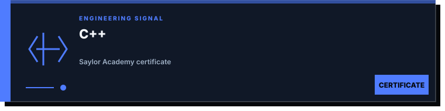</a>
  <a href="https://github.com/MohammedZidanC?tab=repositories">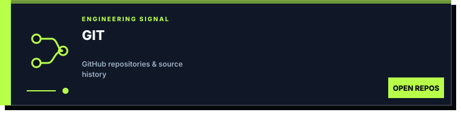</a>

<strong>AI / SUPPORTING TOOLS</strong>

  <a href="certificates/Freedom%20with%20AI%20-%20Certificate.pdf">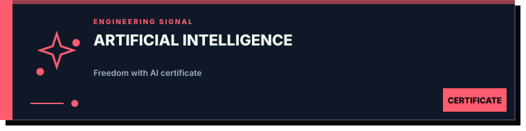</a>
  <a href="https://github.com/MohammedZidanC/NYX">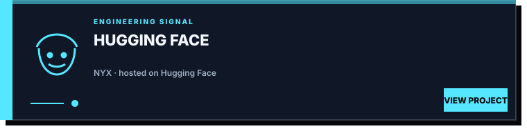</a>

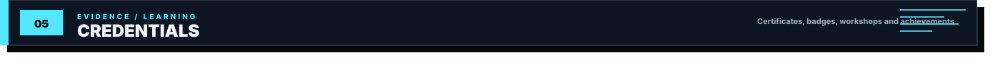

<strong>GOOGLE SKILLS BADGES</strong>

  
  

<strong>01 / ENGINEERING &amp; TECHNICAL</strong>

  <a href="certificates/235197-Verilog%20HDL%20Hands%20On%20Mohammed%20Zidan%20C.pdf">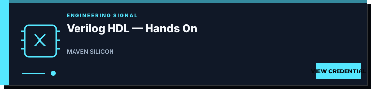</a>
  <a href="certificates/Udemy%20Digital%20Logic%20Design.pdf">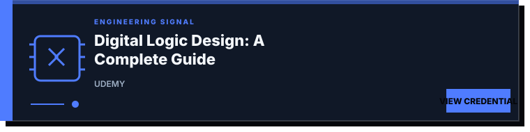</a>
   
  <a href="certificates/Udemy%20Signal%20Processing.pdf">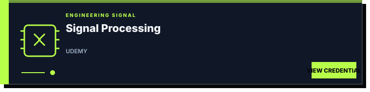</a>
  <a href="certificates/cpp%20saylor.pdf">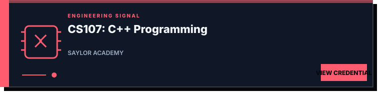</a>
   
  <a href="certificates/udemy%20python.jpg">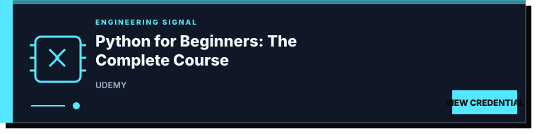</a>
  <a href="certificates/Freedom%20with%20AI%20-%20Certificate.pdf">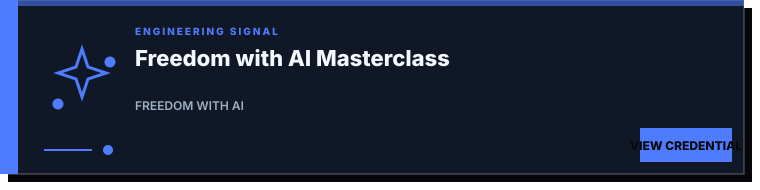</a>
   
  <a href="certificates/Anthropic%20Claude%20Code%20101.pdf">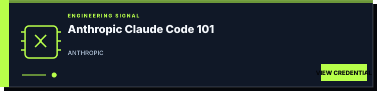</a>
  <a href="certificates/POD%20AI%20Developer%20Tools%20and%20Methodologies.pdf">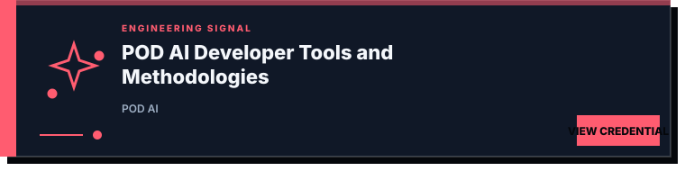</a>

<strong>02 / PROFESSIONAL DEVELOPMENT</strong>

  <a href="certificates/Employability%20skills.pdf">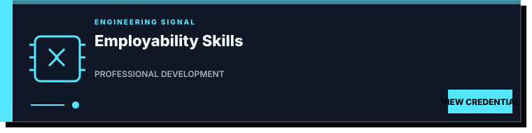</a>
  <a href="certificates/Udemy%20Employability%20skills%20Mastery.pdf">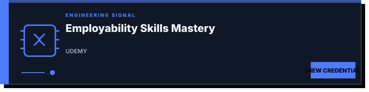</a>
   
  <a href="certificates/Job%20Readiness%20%26%20Professional%20Development%20Program.pdf">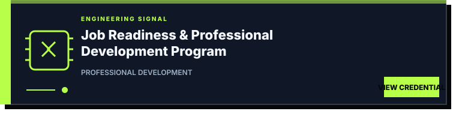</a>
  <a href="certificates/british%20airways%20forage.pdf">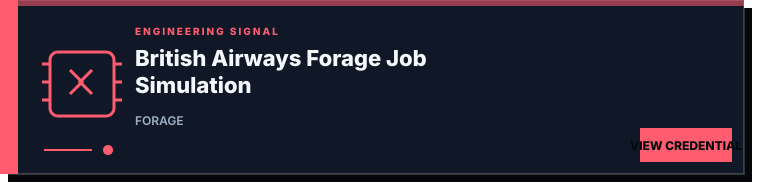</a>

<strong>03 / MEMBERSHIPS &amp; WORKSHOPS</strong>

  <a href="certificates/ISTE%20Membership.pdf">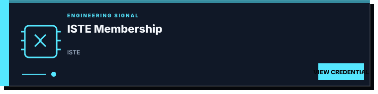</a>
  <a href="certificates/Embedded%20system%20Team%20ARL.jpg">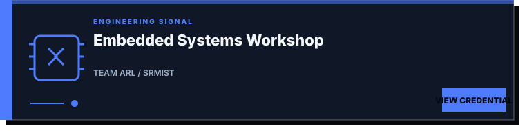</a>

<strong>04 / ACHIEVEMENTS &amp; ACTIVITIES</strong>

  <a href="certificates/Reuse%20and%20Remodel%20Product.jpg">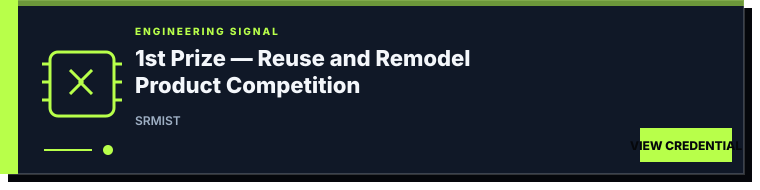</a>
  <a href="certificates/WMO%20Volunteering.jpeg">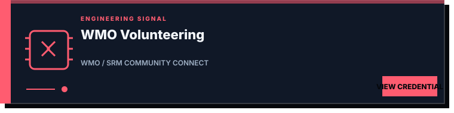</a>
   
  <a href="certificates/Sustainable%20development.pdf">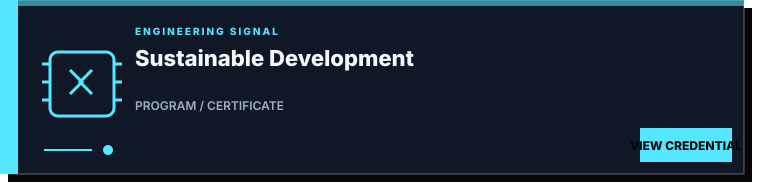</a>

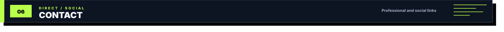

  
  
  
  
  

  VLSI · RTL DESIGN · DIGITAL LOGIC · VERIFICATION · BUILDING WITH INTENT

